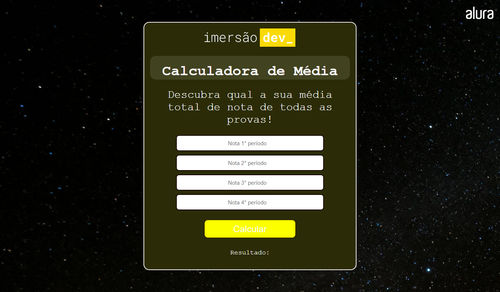

# calculadora
Desenvolvido através da Imersão Dev da Alura 2022.

<b>> = Resultado da calculadora de média.</b>

O projeto foi criado em:

- [x] Criação do HTML
- [x] Criação do CSS
- [x] Criação do JavaScript

Resultado: https://vercel.com/carlossbezerra/calculadora

## Colaboradores

Contribuiu para este projeto:

<table>
  <tr>
    <td align="center">
         
        
          <b>CARLOS BEZERRA</b>
        
      </a>
    </td>
   </tr>
</table>

